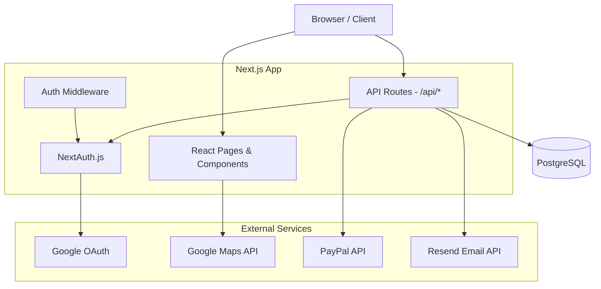

## Overview

Paladin Farm & Ranch is a full-stack Next.js application that connects farmers affected by natural disasters with nearby volunteers and organizations. Users register farms, create emergency requests, and coordinate responses through a real-time map-based dashboard.

## Tech Stack

| Layer | Technology |
|-------|-----------|
| Framework | Next.js 16 (App Router, React 19, Turbopack) |
| Language | TypeScript |
| Database | PostgreSQL |
| ORM | Prisma |
| Auth | NextAuth.js v5 (Google OAuth) |
| Styling | Tailwind CSS |
| Maps | Google Maps JavaScript API |
| Payments | PayPal Subscriptions API |
| Email | Resend |
| Push Notifications | Web Push (VAPID) |
| Docs | Fumadocs (MDX) |
| UI Components | Radix UI, shadcn/ui |
| Diagrams | Mermaid |

## Dependencies

### Core

| Package | Version | Purpose |
|---------|---------|---------|
| `next` | ^16.1.6 | React framework (App Router) |
| `react` / `react-dom` | 19.2.1 | UI library |
| `typescript` | ^5.7.3 | Type safety |
| `@prisma/client` | ^6.4.1 | Database ORM |
| `next-auth` | ^5.0.0-beta.25 | Authentication (Google OAuth) |
| `@auth/prisma-adapter` | ^2.7.4 | NextAuth + Prisma integration |

### UI

| Package | Version | Purpose |
|---------|---------|---------|
| `tailwindcss` | ^3.4.1 | Utility-first CSS |
| `lucide-react` | ^0.464.0 | Icons |
| `ag-grid-react` | ^33.0.3 | Admin data tables |
| `@react-google-maps/api` | ^2.20.6 | Google Maps |
| `next-themes` | ^0.4.4 | Dark / light mode |
| `@radix-ui/*` | various | Headless UI primitives (11 packages) |
| `mermaid` | ^11.14.0 | Client-side diagram rendering |

### Forms and Validation

| Package | Version | Purpose |
|---------|---------|---------|
| `react-hook-form` | ^7.54.2 | Form state management |
| `@hookform/resolvers` | ^4.1.3 | Zod integration for react-hook-form |
| `zod` | ^3.24.2 | Schema validation |

### Services

| Package | Version | Purpose |
|---------|---------|---------|
| `resend` | ^6.9.2 | Transactional email |
| `web-push` | ^3.6.7 | Browser push notifications |
| `@paypal/react-paypal-js` | ^8.9.2 | Donations and subscriptions |

### Documentation

| Package | Version | Purpose |
|---------|---------|---------|
| `fumadocs-core` | ^16.7.10 | In-app documentation framework |
| `fumadocs-mdx` | ^14.2.11 | MDX processing |

### Development Tools

| Package | Version | Purpose |
|---------|---------|---------|
| `vitest` | ^3.1.1 | Unit testing |
| `eslint` / `eslint-config-next` | ^9 / ^16.1.6 | Linting |
| `prettier` | ^3.4.2 | Code formatting |
| `husky` | ^9.1.7 | Git hooks |
| `lint-staged` | ^15.2.11 | Run linters on staged files only |
| `prisma` | ^6.4.1 | Database migrations and tooling |
| `@mermaid-js/mermaid-cli` | ^11.12.0 | Diagram PNG rendering for PDF docs |
| Docker | — | Local PostgreSQL container |

## Architecture Diagram



## Key Directories

```
src/
  app/                    # Next.js App Router
    api/                  # API route handlers
      requests/           # Emergency request CRUD
      organizations/      # Org membership & management
      users/              # User management (admin)
      farms/              # Farm CRUD
      paypal/             # PayPal orders & subscriptions
      ...
    dashboard/            # Map-based dashboard
    organizations/        # Org browsing & management
    profile/              # User profile editing
    registration/         # Multi-step registration
  components/             # React components
  lib/                    # Shared utilities
    auth.ts               # NextAuth config
    prisma.ts             # Prisma client singleton
    email.ts              # Email templates (Resend)
    paypal-subscriptions.ts
  hooks/                  # Custom React hooks
prisma/
  schema.prisma           # Database schema
  migrations/             # Migration history
  seed.mjs                # Seed data
content/docs/             # MDX documentation pages
```

