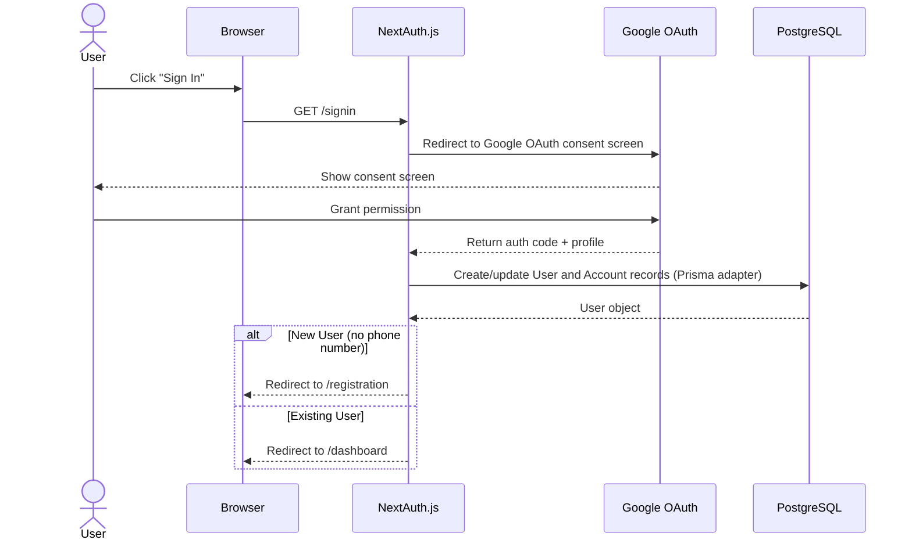
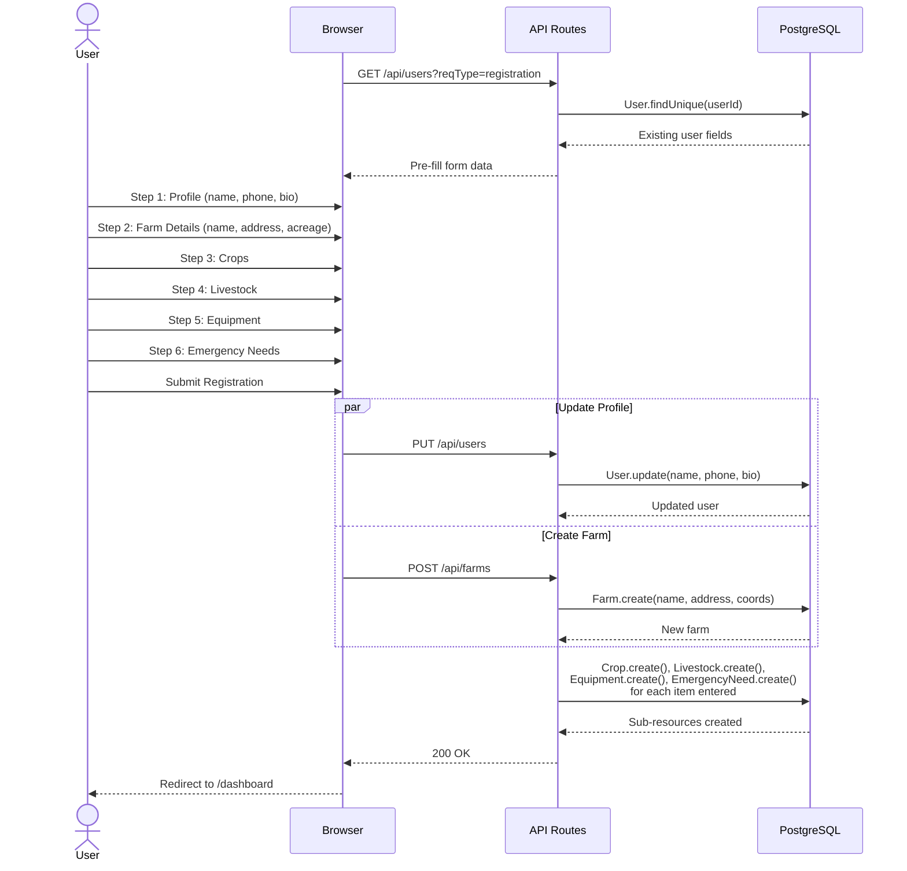

## Authentication

Authentication uses **NextAuth.js v5** with the **Google OAuth** provider. Configuration is in `src/lib/auth.ts`.

Key files:

| File | Purpose |
|------|---------|
| `auth.ts` | NextAuth config — Google provider, Prisma adapter, session callbacks |
| `[...nextauth]/route.ts` | Auth API route handler |
| `signin/page.tsx` | Custom sign-in page |
| `schema.prisma` | User, Account, and Session models (Prisma adapter) |

### How It Works

1. User clicks **Sign In** → redirected to Google OAuth consent screen
2. On success, NextAuth creates/updates `User` and `Account` records via the Prisma adapter
3. A session is created and stored in the `Session` table
4. The `auth()` helper (exported from `src/lib/auth.ts`) is used in API routes and server components to check the session

### Registration Flow

New users are redirected to a multi-step registration form. Each step collects different information and POSTs to the respective API route.

### Account Linking

The config uses `allowDangerousEmailAccountLinking: true` so that Google accounts merge with email-matched records. Since only Google sign-up is supported, this enables seeded test accounts to work with OAuth.

## Authorization

There are two levels of roles:

### Platform Roles (`UserRole`)

Stored on the `User` model. Defined in `prisma/schema.prisma`:

| Role | Access |
|------|--------|
| `ADMIN` | Full access — manage users, review org requests, manage resources, bypass subscription checks |
| `STAFF` | Bypass subscription checks for request creation |
| *(none)* | Regular user — standard access |

### Organization Roles (`OrgRole`)

Stored on `OrganizationMember`. Controls per-org permissions:

| Role | Access |
|------|--------|
| `OWNER` | Full org control — manage members, approve/reject join requests, delete org |
| `MANAGER` | Manage members and join requests (cannot remove owners) |
| `MEMBER` | View-only org membership |

### Where Authorization Is Checked

- **API routes** — each route handler calls `auth()` and checks `session.user.role` or org membership via `checkOrgAdminAccess()` in `src/app/api/organizations/[id]/members/route.ts`
- **Client components** — conditional UI rendering based on `session.user.role` and the user's org role from API responses
