## Diagrams

- [Emergency Requests](#emergency-requests)
  - [Creating an Emergency Request](#creating-an-emergency-request)
  - [Viewing Requests](#viewing-requests)
  - [Responding to a Request](#responding-to-a-request)
  - [Cancelling a Response](#cancelling-a-response)
  - [Closing a Request](#closing-a-request)
- [Organizations](#organizations)
  - [Organization Creation](#organization-creation)
  - [Admin: Approve or Reject Organization](#admin-approve-or-reject-organization)
  - [Joining an Organization](#joining-an-organization)
  - [Managing Organization Members](#managing-organization-members)
- [Profile and Farm Management](#profile-and-farm-management)
  - [View and Update Profile](#view-and-update-profile)
  - [Farm CRUD](#farm-crud)
  - [Farm Sub-Resources](#farm-sub-resources-crops-livestock-equipment-gates-emergency-needs)
- [Admin and System](#admin-and-system)
  - [Admin: User Management](#admin-user-management)
  - [Admin: Disaster Resources](#admin-disaster-resources)
  - [Push Notification Registration](#push-notification-registration)
  - [Contact Us](#contact-us)

## Emergency Requests

### Creating an Emergency Request

1. User fills out the form in `src/components/DashboardPage.tsx`
2. Client POSTs to `src/app/api/requests/route.ts`
3. API validates auth session, checks PayPal subscription status via `src/lib/paypal-subscriptions.ts`
4. Prisma creates the `Request` record in PostgreSQL
5. Push notifications sent to nearby farm owners via `src/app/api/requests/route.ts` → `notify()`
6. Confirmation email sent via `src/lib/email.ts` → Resend API

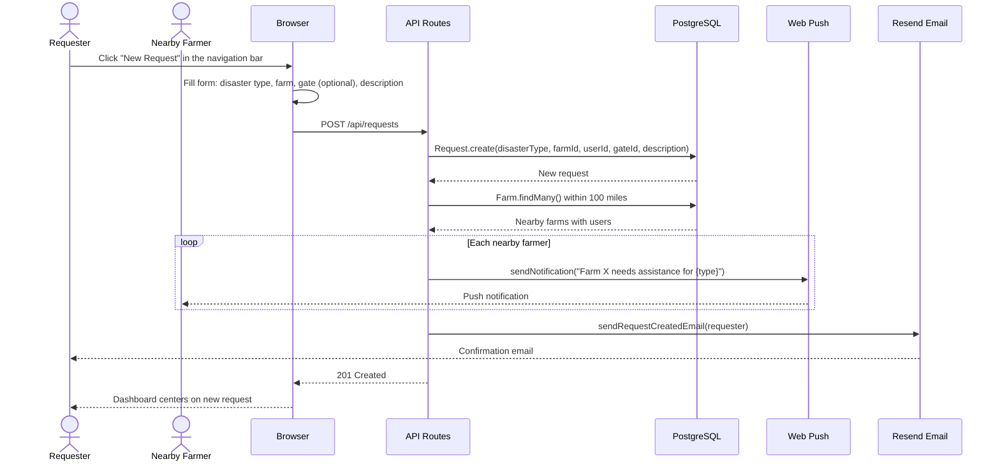

### Viewing Requests

Requests are fetched based on map bounds and filtered by visibility rules depending on user role and sidebar tab.

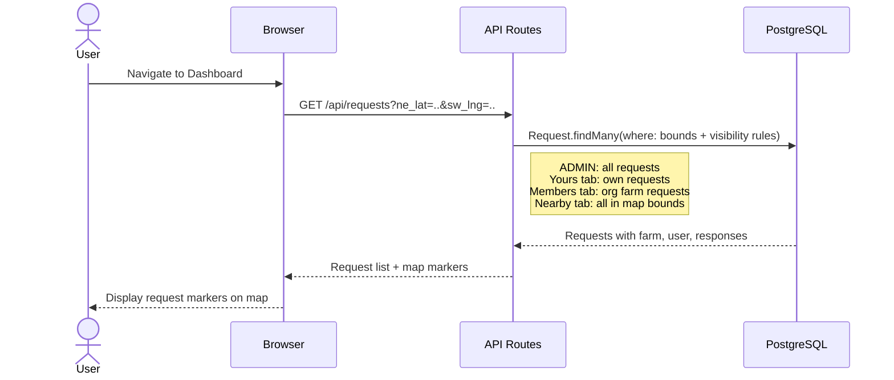

### Responding to a Request

1. User views request details in `src/components/DashboardPage.tsx`
2. Client POSTs response to `src/app/api/requests/[requestId]/respond/route.ts`
3. Request owner notified by email via `src/lib/email.ts`

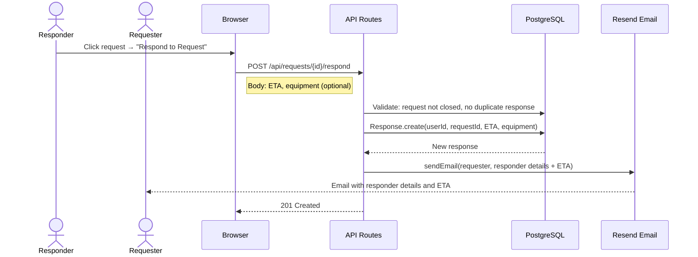

### Cancelling a Response

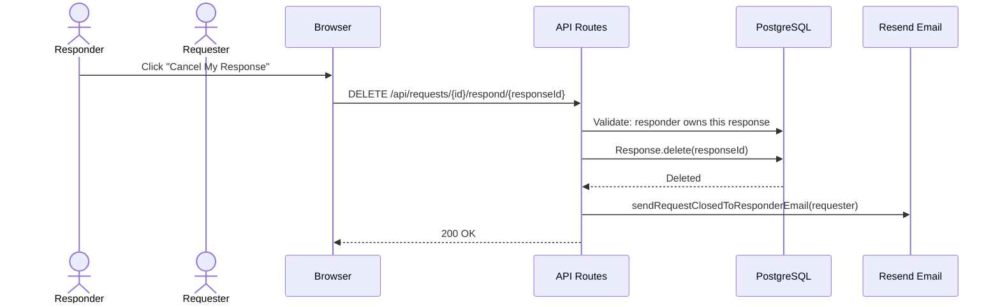

### Closing a Request

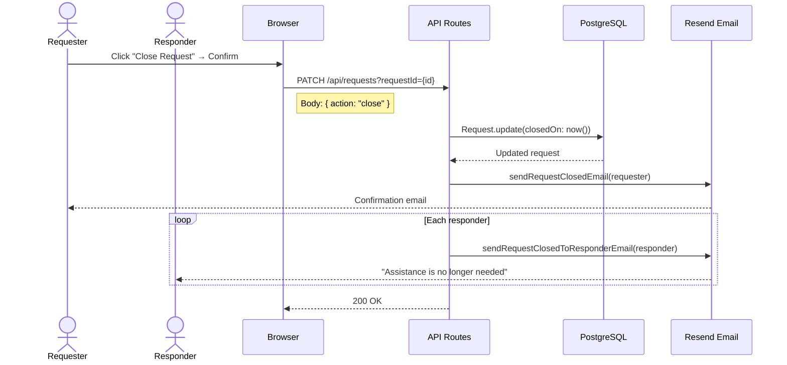

## Organizations

### Organization Creation

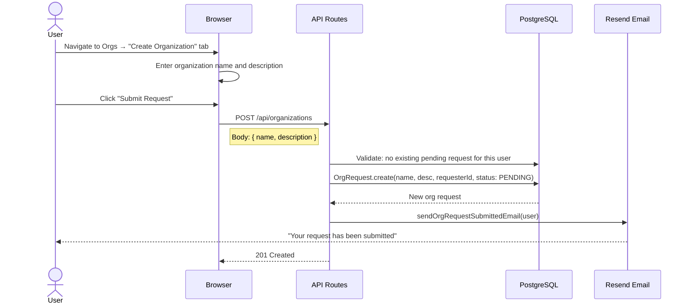

### Admin: Approve or Reject Organization

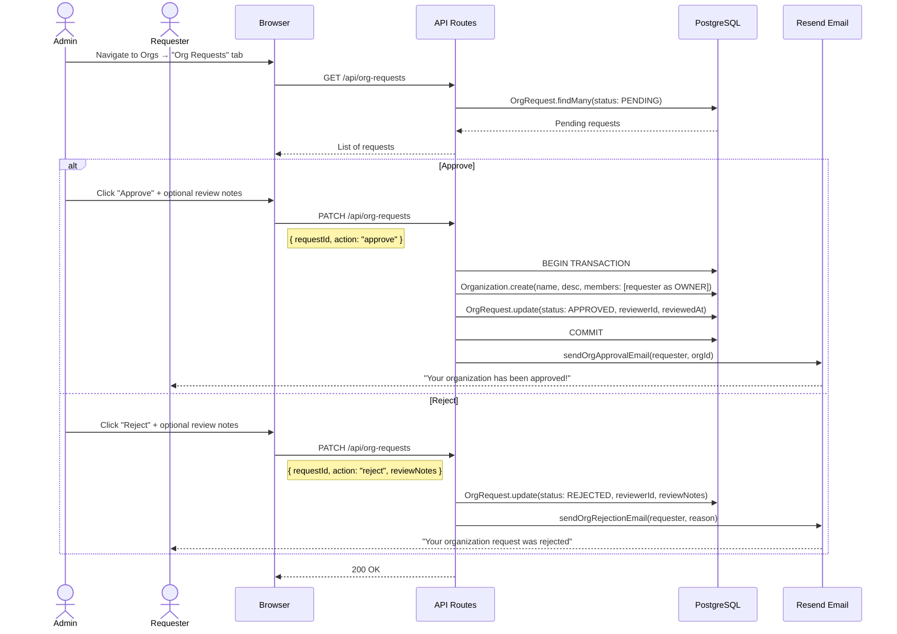

### Joining an Organization

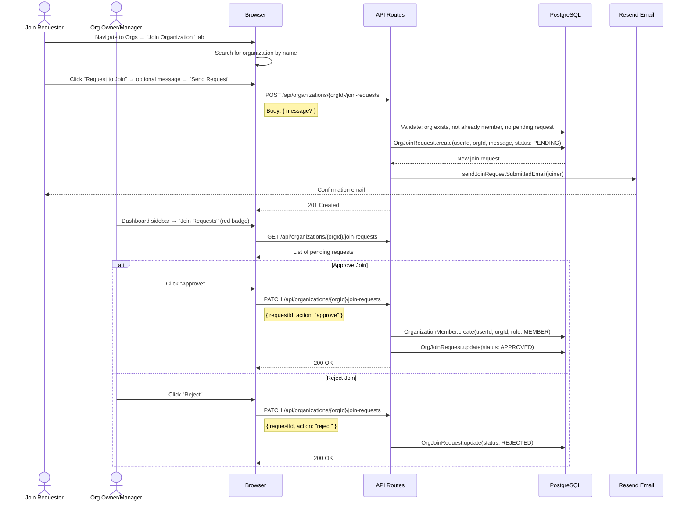

### Managing Organization Members

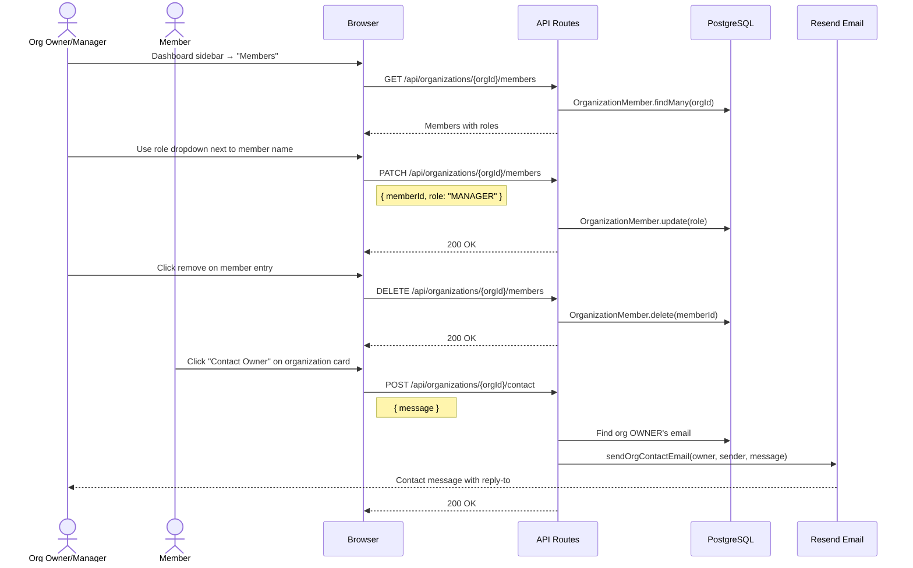

## Profile and Farm Management

### View and Update Profile

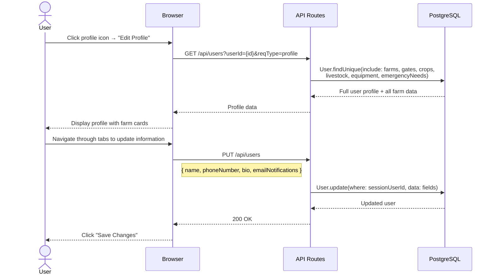

### Farm CRUD

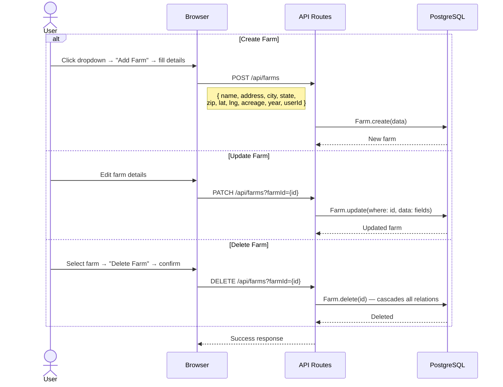

### Farm Sub-Resources (Crops, Livestock, Equipment, Gates, Emergency Needs)

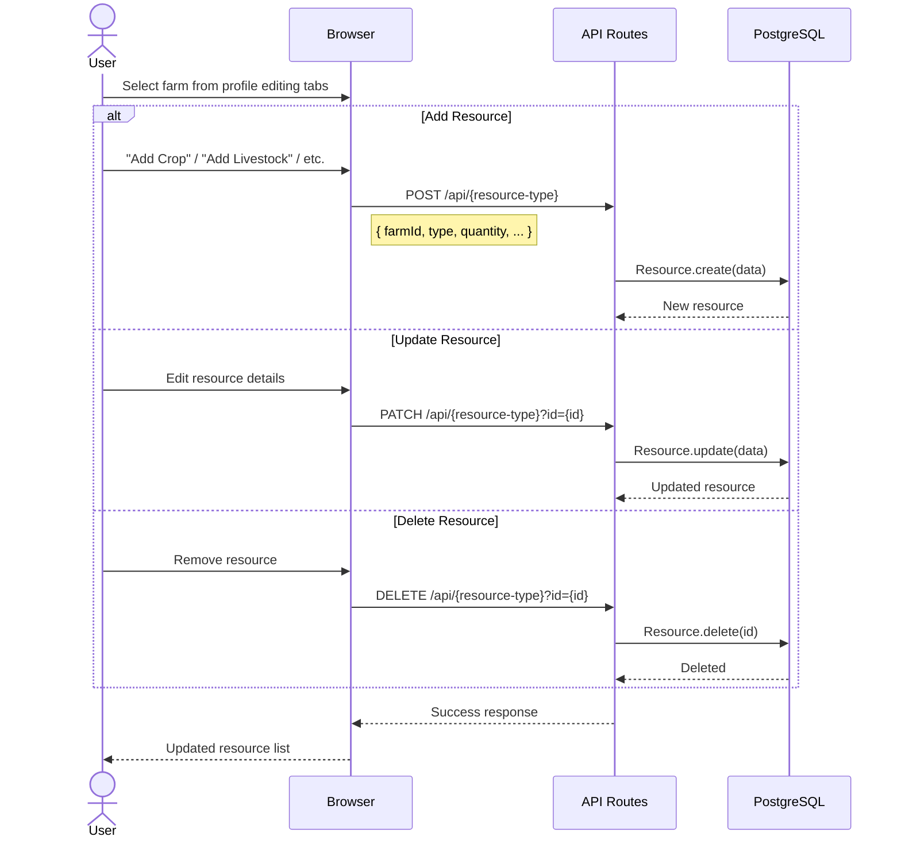

## Admin and System

### Admin: User Management

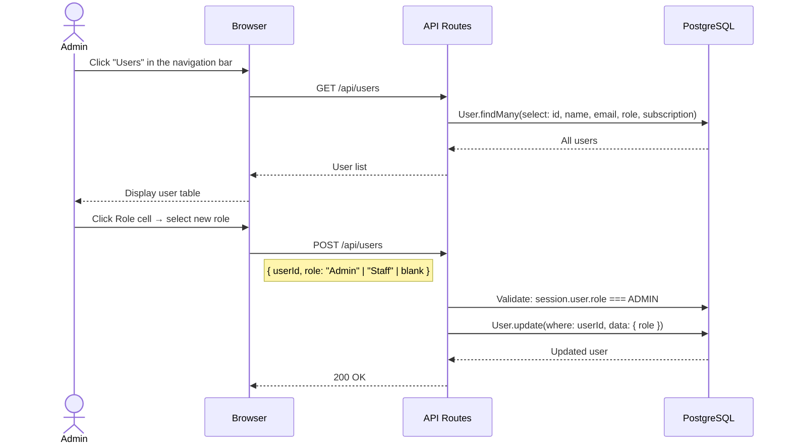

### Admin: Disaster Resources

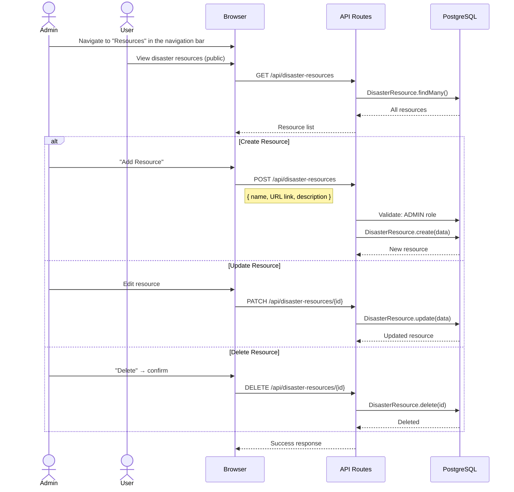

### Push Notification Registration

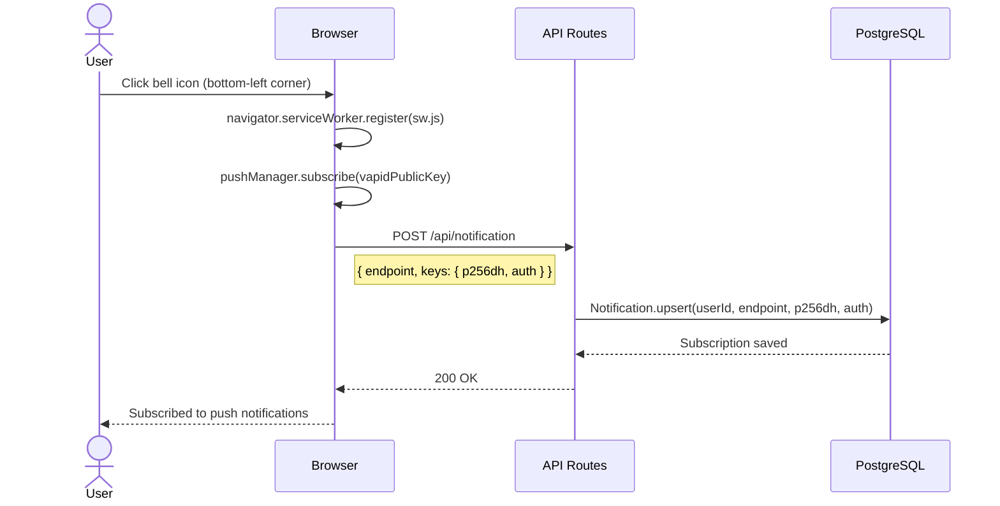

### Contact Us

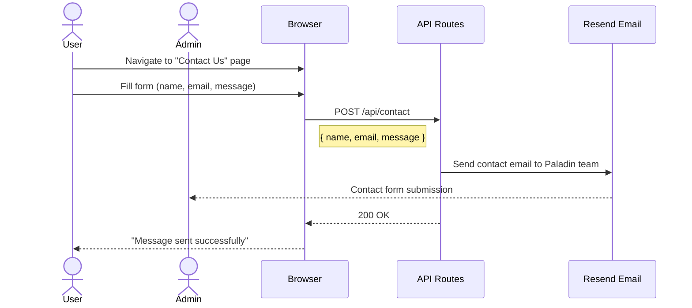
