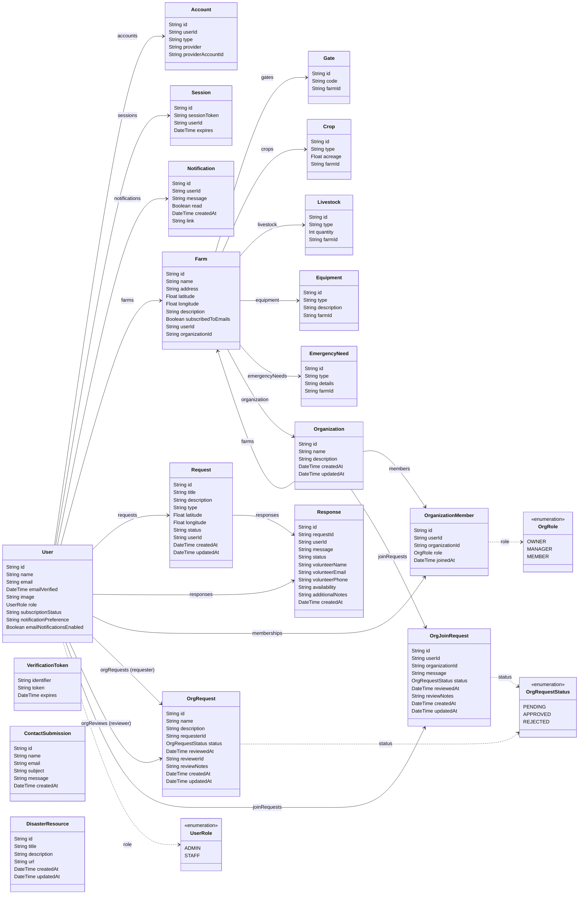

## Overview

The Prisma schema defines the application's data model backed by PostgreSQL. The schema is located at `prisma/schema.prisma` and covers user accounts, farms, emergency requests/responses, organizations, and supporting entities.

## Class Diagram

## Model Groups

### Authentication & Identity

- **User** — Central model. Stores profile info, role (`ADMIN` / `STAFF`), subscription status, and notification preferences. All other user-scoped models reference this.
- **Account** — OAuth provider link (Google). One user can have multiple provider accounts.
- **Session** — Active browser session with expiry. Managed by NextAuth.
- **VerificationToken** — Email verification tokens (NextAuth).

### Farm & Assets

- **Farm** — Registered farm with address, GPS coordinates, and optional organization membership. Owned by one `User`.
- **Gate** — Named gate/access point on a farm.
- **Crop** — Crop type and acreage.
- **Livestock** — Livestock type and count.
- **Equipment** — Farm equipment entries.
- **EmergencyNeed** — Specific needs declared during an emergency request.

### Requests & Responses

- **Request** — Emergency assistance request with type, status, and map coordinates. Created by a `User`.
- **Response** — Volunteer response to a request, including contact details, availability, and status.

### Organizations

- **Organization** — Group that farms can belong to. Has members and incoming join requests.
- **OrganizationMember** — Join table linking `User` to `Organization` with an `OrgRole` (`OWNER` / `MANAGER` / `MEMBER`).
- **OrgRequest** — Request to create a new organization. Reviewed by an admin.
- **OrgJoinRequest** — Request from a user to join an existing organization.

### Standalone

- **ContactSubmission** — Public contact-us form submissions.
- **DisasterResource** — Admin-curated disaster preparedness resources.
- **Notification** — In-app notifications with read status and optional deep-link.

## Enumerations

| Enum | Values | Used By |
|------|--------|---------|
| `UserRole` | `ADMIN`, `STAFF` | `User.role` |
| `OrgRole` | `OWNER`, `MANAGER`, `MEMBER` | `OrganizationMember.role` |
| `OrgRequestStatus` | `PENDING`, `APPROVED`, `REJECTED` | `OrgRequest.status`, `OrgJoinRequest.status` |
