# Paladin Farm & Ranch Developer Documentation

**Authors**: Benjamin King, Fernanda Vela, Joshua Edge, Zhehao Chen  
**Emails**: bking306@gatech.edu, mhuerta30@gatech.edu, jedge31@gatech.edu, zchen367@gatech.edu

**TA**: Justin McLellan

---

## Table of Contents

- [Project Description and Architecture Diagram](#project-description-and-architecture-diagram)
- [Technology Stack](#technology-stack)
- [Architecture Diagram](#architecture-diagram)
- [Database Diagram](#database-diagram)
- [Data Flow](#data-flow)
- [Recommended Hosting](#recommended-hosting)
- [Application Installation](#application-installation)
- [Authentication and Authorization](#authentication-and-authorization)
- [Database Backup](#database-backup)
- [Environment Variables](#environment-variables)
- [Partner Statement](#partner-statement)
- [Installation Walkthrough Statement](#installation-walkthrough-statement)
- [Deliverable Screenshots and Statement](#deliverable-screenshots-and-statement)
- [Lighthouse Scores](#lighthouse-scores)
- [Form Factor Analysis](#form-factor-analysis)
- [UX Considerations](#ux-considerations)

---

## Project Description and Architecture Diagram

This is a full-stack web application for Computing for Good deployed at [paladinfarmandranch.com](https://paladinfarmandranch.com/). Built using Next.js, it includes:

- Role-based access
- Google OAuth authentication
- PostgreSQL for data persistence
- Docker & Prisma ORM

---

## Technology Stack

- **Next.js** – Framework
- **TypeScript**
- **Tailwind** – Atomic CSS
- **Prisma** – ORM
- **Prettier** – Formatter
- **ESLint** – Code policy enforcement
- **Husky** – Git hooks
- **Lint-Staged** – Staged code linting
- **Docker** – Containers
- **PostgreSQL** – Database
- **GitHub Actions** – CI/CD
- **Nginx** – Web server
- **Shadcn** – UI components
- **RadixUI** – UI primitives
- **Lucide-React** – Icons
- **Next-Auth** – Google OAuth
- **Ag-Grid** – Tables & grids

---

## Architecture Diagram

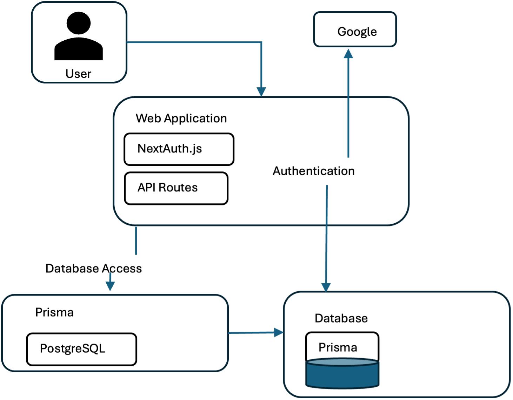

---

## Database Diagram

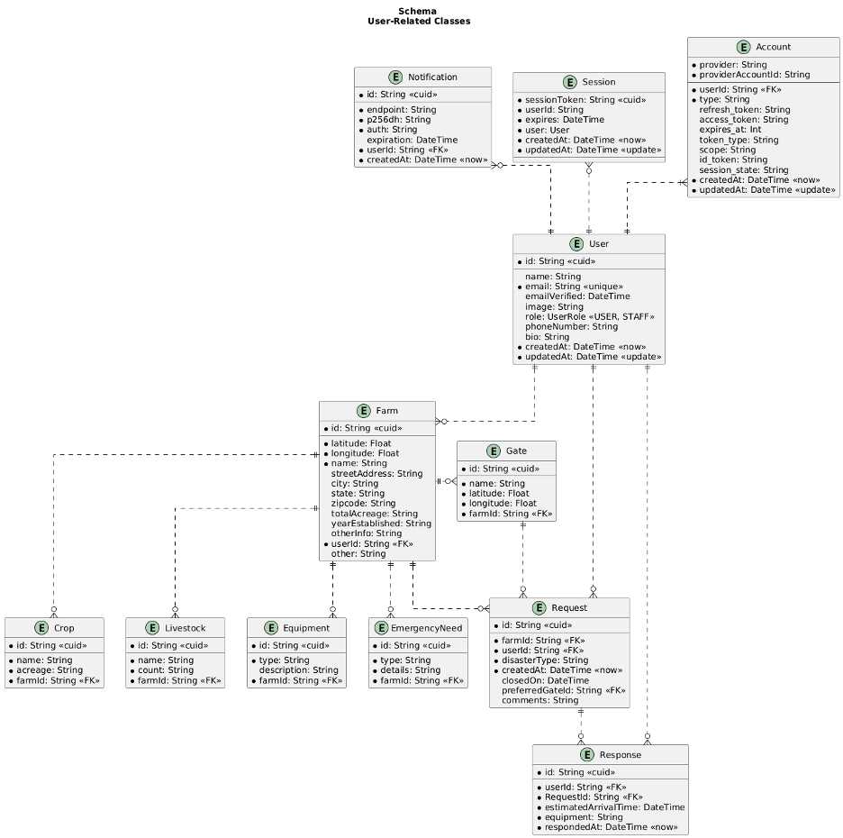

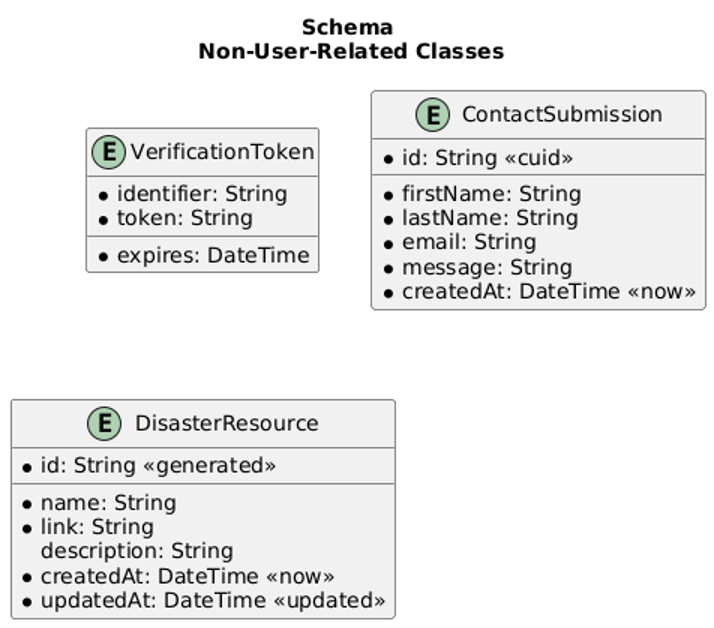

---

## Data Flow

### 1. User Logs In via Google

| Step | Description              | File(s)                                |
| ---- | ------------------------ | -------------------------------------- |
| 1    | Clicks login             | `pages/index.tsx`                      |
| 2    | Redirect to Google OAuth | `pages/api/auth/[...nextauth].ts`      |
| 3    | Session managed          | `lib/auth.ts`, `NextAuth.js` config    |
| 4    | Session injected         | `app/layout.tsx`, `getServerSession()` |

### 2. Admin Views Users

| Step | Description            | File(s)                                 |
| ---- | ---------------------- | --------------------------------------- |
| 1    | Navigate to users page | `app/admin/users/page.tsx`              |
| 2    | API call               | `pages/api/users/index.ts`              |
| 3    | DB access              | `prisma/schema.prisma`, `lib/prisma.ts` |
| 4    | Data display           | `UserTable.tsx`                         |

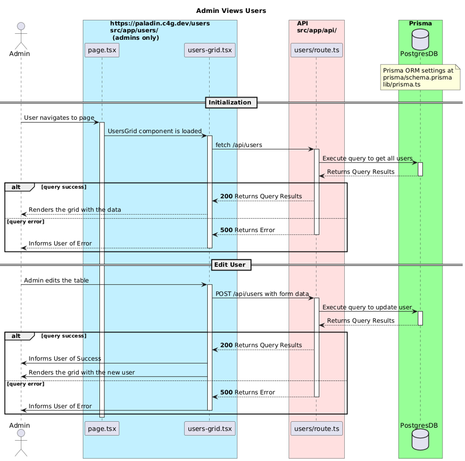

### 3. User Submits a Disaster Resource

| Step | Description      | File(s)                          |
| ---- | ---------------- | -------------------------------- |
| 1    | Navigate to form | `app/resources/new/page.tsx`     |
| 2    | Fill out form    | `ResourceForm.tsx`               |
| 3    | POST to API      | `pages/api/resources/index.ts`   |
| 4    | DB write         | `lib/prisma.ts`, `schema.prisma` |
| 5    | Confirmation     | `app/resources/page.tsx`         |

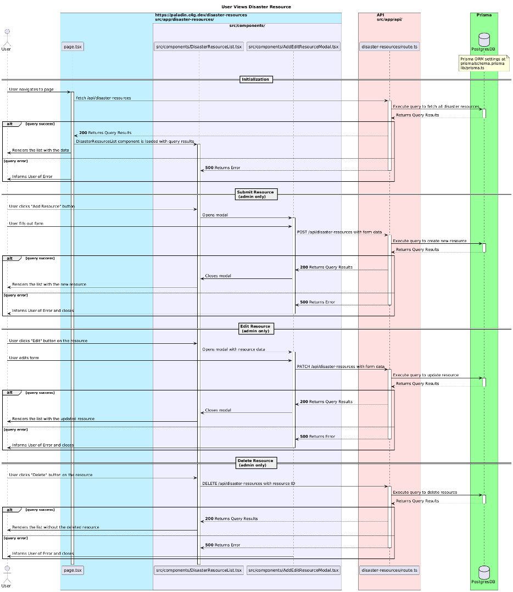

### 4. User Views Dashboard

| Step | Description             | File(s)                                 |
| ---- | ----------------------- | --------------------------------------- |
| 1    | Login & go to dashboard | `app/dashboard/page.tsx`                |
| 2    | Fetch session           | `lib/auth.ts`                           |
| 3    | Query data              | `lib/prisma.ts`                         |
| 4    | Render UI               | `DashboardCards.tsx`, `RequestList.tsx` |

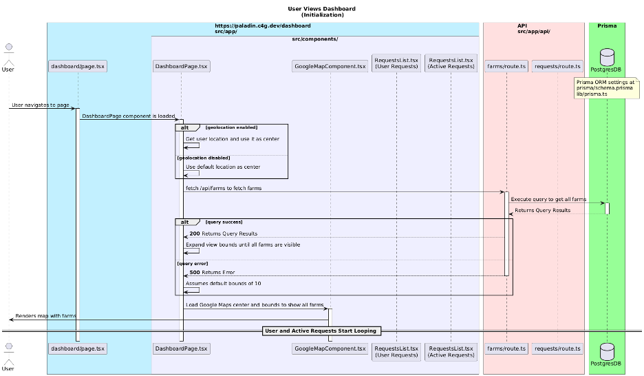

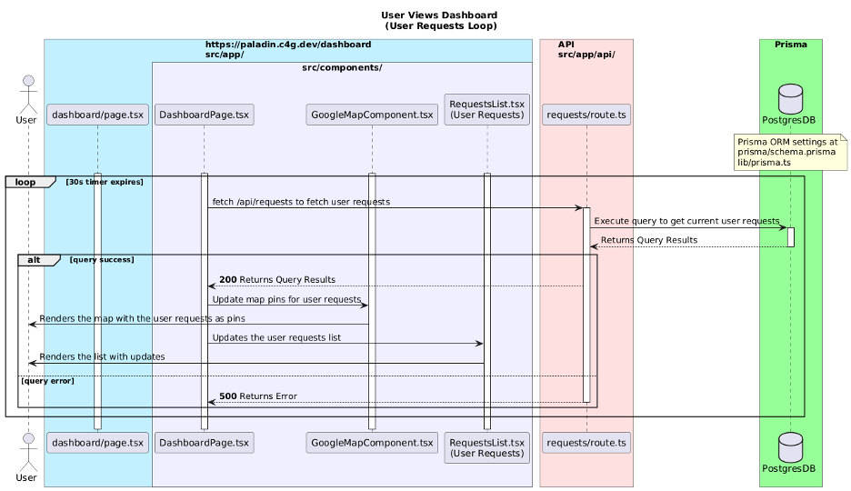

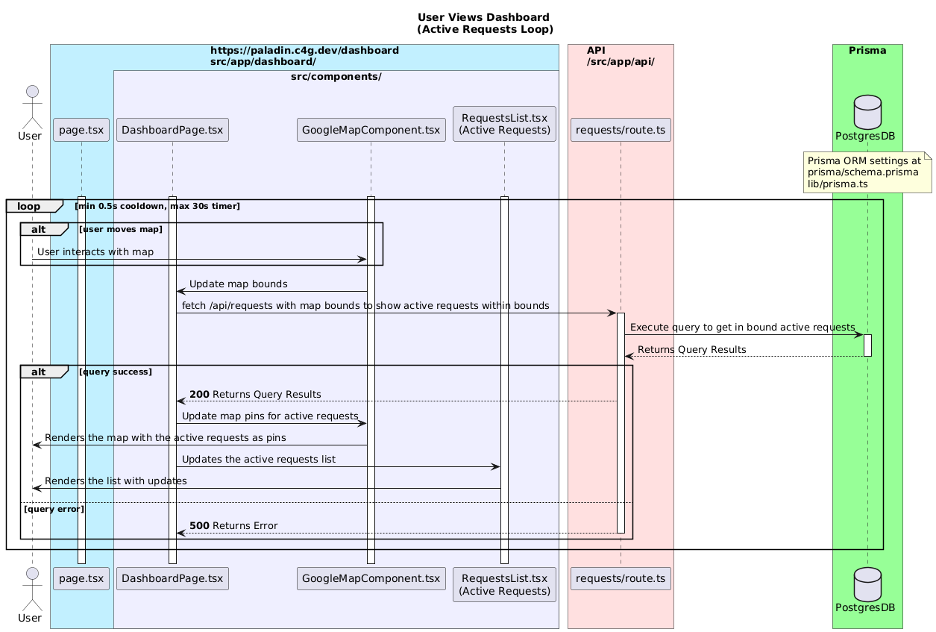

### 5. User Creates New Request

| Step | Description       | File(s)                          |
| ---- | ----------------- | -------------------------------- |
| 1    | Open request form | `app/requests/new/page.tsx`      |
| 2    | Fill & submit     | `RequestForm.tsx`                |
| 3    | POST to API       | `pages/api/requests/index.ts`    |
| 4    | Create DB record  | `lib/prisma.ts`, `schema.prisma` |
| 5    | Redirect/confirm  | `useRouter().push()`             |

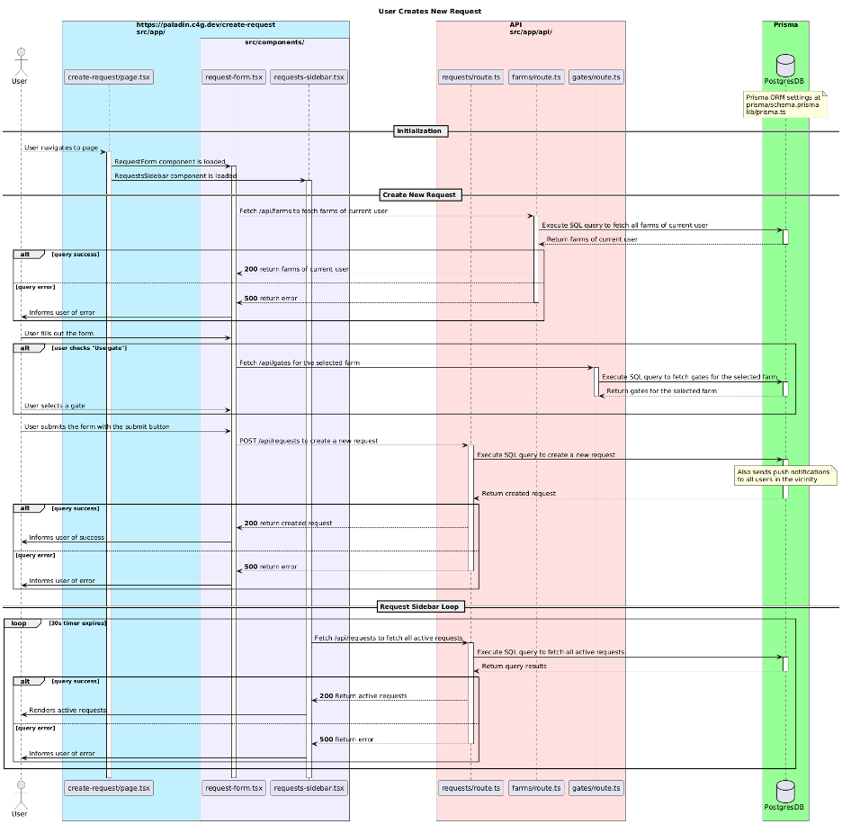

### 6. User Views Active Requests

| Step | Description        | File(s)                              |
| ---- | ------------------ | ------------------------------------ |
| 1    | Open requests page | `app/requests/page.tsx`              |
| 2    | Fetch requests     | `pages/api/requests/index.ts`        |
| 3    | Query DB           | `lib/prisma.ts`                      |
| 4    | Display UI         | `RequestList.tsx`, `RequestCard.tsx` |

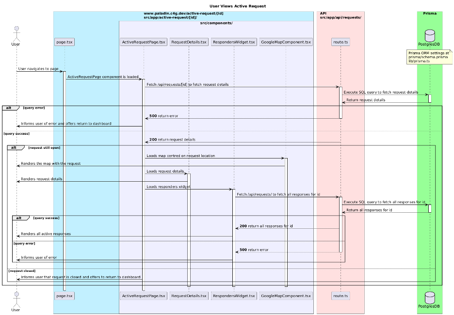

### 7. User Responds to a Request

| Step | Description      | File(s)                            |
| ---- | ---------------- | ---------------------------------- |
| 1    | Open detail page | `app/requests/[id]/page.tsx`       |
| 2    | Fetch data       | `getServerSideProps()`             |
| 3    | Submit reply     | `ReplyForm.tsx`                    |
| 4    | POST reply       | `pages/api/requests/[id]/reply.ts` |
| 5    | DB update        | `lib/prisma.ts`, `schema.prisma`   |
| 6    | UI update        | Router reload                      |

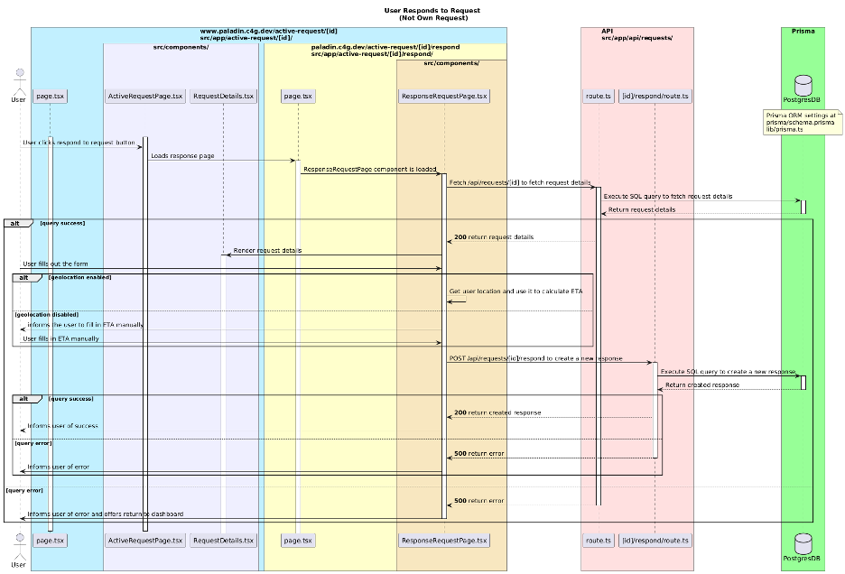

### 8. User Updates Profile

| Step | Description   | File(s)                              |
| ---- | ------------- | ------------------------------------ |
| 1    | Profile page  | `app/profile/page.tsx`               |
| 2    | Load session  | `lib/auth.ts`                        |
| 3    | Fetch user    | `lib/prisma.ts`                      |
| 4    | Show form     | `ProfileForm.tsx`, `UserDetails.tsx` |
| 5    | Submit update | `pages/api/users/update.ts`          |
| 6    | Update DB     | `lib/prisma.ts`                      |
| 7    | Refresh       | `useRouter().reload()`               |

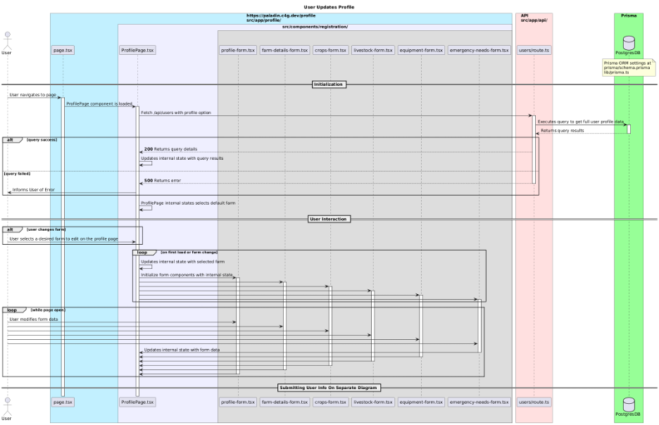

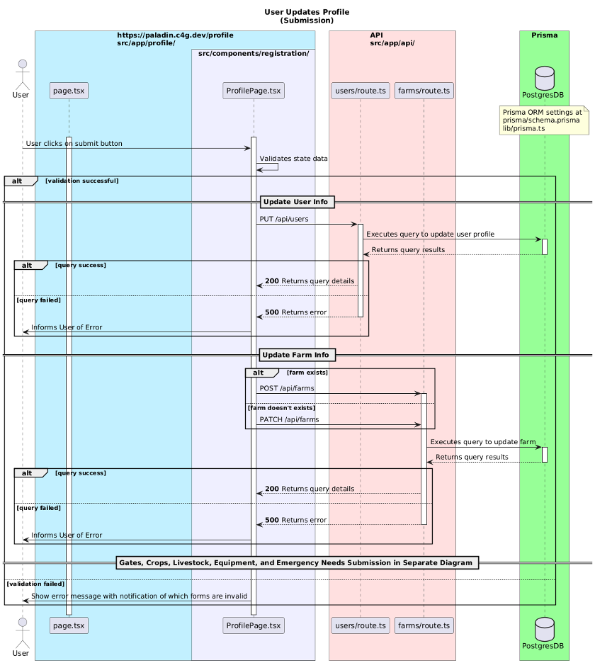

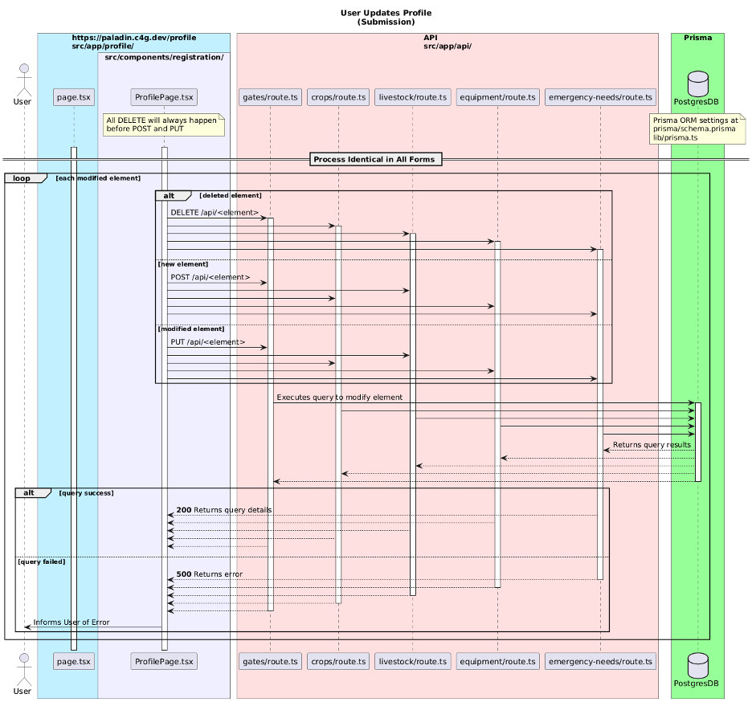

---

## Recommended Hosting

### Database

The application uses a PostgreSQL database to manage and store structured data. Prisma is used
as an ORM for handling the database schema, enabling smooth data modeling, migrations, and
access during local development.

### Website

The website is developed using Node.js with npm for package management and running the
development stack. It is deployed using Nginx for efficient hosting and load handling. Continuous
integration and deployment (CI/CD) is set up via GitHub, automatically deploying changes to
production whenever a branch is merged into main. The website can be accessed by this link:
[https://paladinfarmandranch.com](https://paladinfarmandranch.com/)

---

## Application Installation

1. Prerequisites:
   - Git or GitHub Desktop
   - Node.js + npm
   - Docker

2. Clone the repo:

```bash
# SSH
git clone git@github.gatech.edu:cs-6150-computing-for-good/template.git

# HTTPS
git clone https://github.gatech.edu/cs-6150-computing-for-good/template.git
```

3. Get the `.env` file from Teams or a TA.

4. Install dependencies:

```bash
npm i
```

5. Initialize DB and seed data:

```bash
npm run init
```

6. Start dev server:

```bash
npm run dev
```

Visit `http://localhost:3000`.

7. Login:

| Email                 | Password         | Role  |
| --------------------- | ---------------- | ----- |
| c4gdevad@gmail.com    | EHdqcGJajTAnSy$8 | ADMIN |
| c4gdevstaff@gmail.com | JCbSk3&&JF!h#m@x | STAFF |

8. Open Prisma Studio:

```bash
npx prisma studio
```

Visit `http://localhost:5555`.

---

## Authentication and Authorization

- Handled via NextAuth.js + Google OAuth 2.0
- Secure token handling via OAuth 2.0 Authorization Code Grant
- The configuration for authentication is in the `pages/api/auth/[...nextauth].ts ` file, where the Google provider is set up. Once the user is authenticated, their profile is either created in the database (if it's their first time) or retrieved from existing records. The session token includes key user attributes, such as email, ID, and their assigned role.
- Authorization is implemented via role-based access control. Each user in the database has
  a role field, defined in the Prisma schema (`prisma/schema.prisma`). The roles
  include: `USER`, `STAFF`, `ADMIN`.

---

## Database Backup

Our database is handled using Docker volumes, ensuring that data is persisted even if containers
are restarted or rebuilt. While there is no automated backup system currently in place, the mentor is familiar with the database infrastructure and can perform manual backups as needed.

---

## Environment Variables

Required:

```
DATABASE_PW
DATABASE_USER
DATABASE_NAME
DATABASE_HOST
DATABASE_PORT
DATABASE_URL (local + production)
AUTH_SECRET
AUTH_GOOGLE_ID
AUTH_GOOGLE_SECRET
NEXT_PUBLIC_GOOGLE_MAPS_API_KEY
```

PayPal (subscriptions / donation button):

```
NEXT_PUBLIC_PAYPAL_CLIENT_ID    # Same app client ID (exposed to browser for the JS SDK)
NEXT_PUBLIC_PAYPAL_PLAN_ID      # Subscription plan_id ($10/month, etc.)
PAYPAL_CLIENT_ID                # Same client ID for server OAuth (optional if NEXT_PUBLIC is set)
PAYPAL_SECRET                   # Required on the server to verify subscriptions against PayPal
PAYPAL_API_BASE                 # Optional; omit or sandbox URL for testing; live: https://api-m.paypal.com
```

GitHub Actions: store `PAYPAL_CLIENT_ID`, `PAYPAL_PLAN_ID`, and `PAYPAL_SECRET` as repository secrets. CI maps `PAYPAL_CLIENT_ID` / `PAYPAL_PLAN_ID` to `NEXT_PUBLIC_*` for the build. CD writes `NEXT_PUBLIC_*`, `PAYPAL_CLIENT_ID`, `PAYPAL_SECRET`, and optional `PAYPAL_API_BASE` into the deployed `.env` and passes PayPal vars through PM2 so API routes can verify subscriptions.

To set up recurring $10/month donations, create a subscription **Plan** in your PayPal (or Sandbox) dashboard for $10/month, then paste its `plan_id` into `NEXT_PUBLIC_PAYPAL_PLAN_ID`.

---

## Partner Statement

Partner understands the basics of the developer documentation.  
**Date Confirmed**: April 17, 2025

---

## Installation Walkthrough Statement

Walkthrough was conducted on **April 17, 2025**.

---

## Deliverable Screenshots and Statement

### Lighthouse Scores

- Desktop
  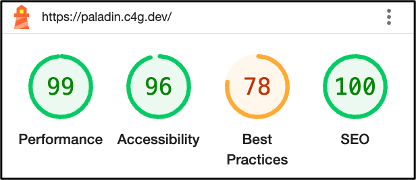

- Mobile
  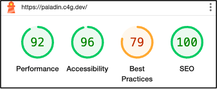

### Form Factor Analysis

- iPhone 12 Pro
  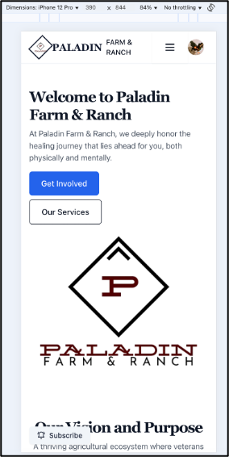
- iPad Pro
  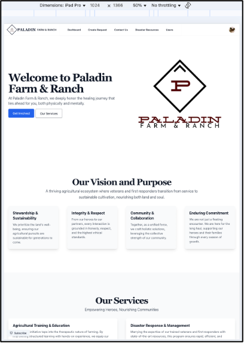
- MacBook Pro 14”
  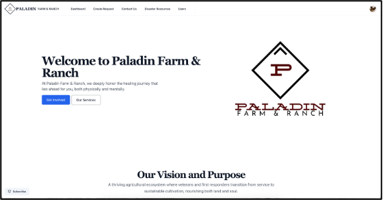

---

## UX Considerations

- Optimize images: Some images might be larger than they need to be for how they're displayed. Making them the right size saves data and speeds up loading, especially for users
  with slower internet.
- Reduce unused JavaScript: The website is loading a lot of code that isn't being used
  immediately. This is the biggest potential improvement.
  `https://paladinfarmandranch.com/_next/static/chunks/1517-07abda82ff5c9fad.js`
- PayPal cache: increasing the cache lifetime for the PayPal images to a more reasonable period (e.g., a few days or even weeks, depending on how often these images are updated).
  This would reduce the need to re-download them frequently, leading to faster page loads for repeat visitors.
